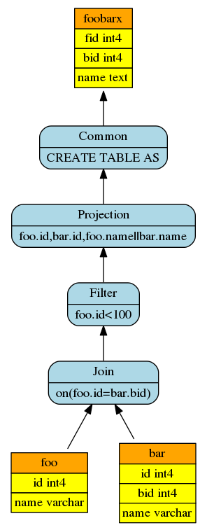
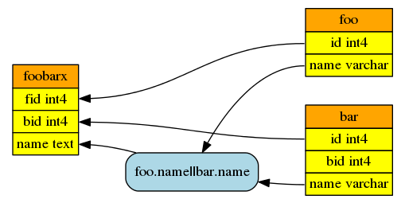

#yprov-jk
* 使用json存储起源数据和利用PG的hook机制实现版本的**yprov**

##简介
yprov是基于PostgreSQL数据库的数据起源实现，**数据起源（data provenance）**是分析一个系统中数据的创建，更改，转化过程，从而追溯数据的起源信息的技术。在数据库中，表现为数据库管理过程中涉及数据的导入创建，查询转化等过过程，例如一个表通过一个查询结果来创建，则该表的模式来源于这个查询结果的结构，该表的数据可能来源于这个查询所涉及的起源表。
yprov是C语言编写的PostgreSQL扩展（extension）模块，意在不同的粒度，即模式级粒度、列级粒度、元组级粒度上提取PG中主要的数据起源信息。yprov-jk是目前实现的简陋的原型系统，能够在数据表的创建和查询中提取模式级和列级的起源信息，并将结构化的起源信息以json文件存储。
##安装
yprov-jk目前仅在Ubuntu14.04的PostgreSQL9.5版本测试过，其他平台版本未验证。
1. 安装PostgreSQL9.5，假设安装路径为*pg-dir*，数据库数据所在路径（即$PG_DATA）为*pg-data*
2. 修改PG的配置文件*pg-data*/postgresql.conf，在文件末尾添加类似以下内容
```
#yprov
yprov.dir = '/home/bon/yprov/'
```
yprov.dir即yprov管理数据的路径，包括json数据文件和一些调试信息等，这里设置为'/home/bon/yprov/'
3. 创建存放json数据文件的路径
```
mkdir /home/bon/yprov/data
```
4. 编译yprov，其中yprov-build是编译路径，yprov-dir/src是yprov源码路径（即Cmakefiles.txt所在路径），make之后yprov-build中生成库文件libyprov.so
```
cd yprov-build
cmake yprov-dir/src
make
```
5. 在PG中安装extension
在路径*pg-dir*/share/postgresql/extension下添加2个文件用于辅助创建extension，这两个文件分别为yprov.control和yprov-1.0.sql，其内容分别如下，其中yprov-build为库文件libyprov.so所在路径。
```
comment = 'data provenance for PG'
default_version = '1.0'
module_pathname = 'yprov-build'
```
```sql
 CREATE OR REPLACE FUNCTION yprov_open()
 RETURNS integer
 AS
 'yprov-build/libyprov.so','yprov_open'
 LANGUAGE C;

 CREATE OR REPLACE FUNCTION yprov_close()
 RETURNS integer
 AS
 'yprov-build/libyprov.so','yprov_close'
 LANGUAGE C;
```
此时已经做好安装extension的准备工作，使用'CREATE EXTENSION'的SQL命令创建extension，可以在psql中输入：
```sql
CREATE EXTENSION yprov;
```
创建extension同时也创建了两个函数yprov_open和yprov_close.

##使用
这里以一个简单的例子说明yprov使用。
1. 创建测试表
```sql
CREATE TABLE foo(id integer,name varchar(30));
INSERT INTO foo VALUES(1,'abc');
INSERT INTO foo VALUES(11,'abccba');
INSERT INTO foo VALUES(100,'foo100');
CREATE TABLE bar(id integer,bid integer,name varchar(30));
INSERT INTO bar VALUES(11,1,'abccba');
INSERT INTO bar VALUES(22,2,'bar22');
INSERT INTO bar VALUES(100,211,'bar100');
```
2. 开启yprov提取数据起源信息的功能，yprov将会监视每个相关的SQL命令，SQL执行之后，yprov会提取其中涉及的数据起源信息，并写入到json数据文件。
```sql
SELECT yprov_open();
```
关闭yprov提取数据起源信息的功能之后，不再监视每个相关的SQL命令，PG还原回原来的模式。
```sql
SELECT yprov_close();
```
3. 执行通过查询结果创建表的SQL
```sql
CREATE TABLE foobarx(fid,bid,name) AS
SELECT foo.id,bar.id,foo.name||bar.name
FROM foo JOIN bar ON (foo.id=bar.bid)
WHERE foo.id<100
```
SQL执行之后，创建表foobarx，其模式起源于查询结果的结构，数据可能来源于表foo和bar
4. 使用工具yprovq分析json数据文件，查询foobarx的数据起源信息
```
cd yprov-dir/tool
python3 yprovq.py query /home/bon/yprov/data foobarx output-dir
```
yprovq.py是使用Python3编写的查询工具（python2不兼容），输入多个参数（query查询选项，/home/bon/yprov/data是json文件所在路径，foobarx为所查询的表名称，output-dir是可选的生成可视化结果的输出路径），生成可视化结果，即2个[Graphviz](http://www.graphviz.org/)的dot绘图脚本和对应的png图像，分别对应模式级起源视图和列级起源视图。因此生成可视化图像需要安装Graphviz的Dot程序。
 - 成的模式级视图foobarx_tbl.png：

 - 成的列级视图foobarx_col.png：

 - 元组级起源模型较复杂，暂未实现

##TODO
yprov-jk是在PostgreSQL中实现数据起源的原型系统，较为简陋，有很多需要完善的地方，其中很重要的部分包括：
- 实现元组级起源模型
- 完善数据起源模型的存储系统。然而目前使用json文件独立存储起源信息还是有必要的，这种方式相对简单，易于验证。
- 数据起源查询系统（客户端）的实现